# Data Quality Assessment Framework Documentation

## 1. Project Overview
The **Data Quality Assessment Framework** is a comprehensive tool designed to evaluate the quality, readiness, and completeness of both structured (CSV, Parquet, JSON) and unstructured (PDF, Images, Audio) datasets. It generates detailed JSON reports and PDF summaries, providing scores based on various metrics like missingness, variance, format consistency, and documentation presence.

## 2. Installation & Setup

### Prerequisites
- Python 3.8+
- AWS Credentials (if running in Lambda/S3 mode)
- OpenAI API Key (for role inference)

### Installation
1. Clone the repository.
2. Install dependencies:
   ```bash
   pip install -r requirements.txt
   ```

### Configuration
Create a `.env` file in the root directory with the following variables:

```ini
# Required for Column/Role Inference
OPENAI_API_KEY=your_openai_api_key

# Required for CAT API Updates (if used)
ELASTIC_ID=your_elastic_id
ELASTIC_PASS=your_elastic_password

# Required for AWS Lambda / S3 Usage
S3_BUCKET_NAME=your_input_bucket_name
S3_REPORTS_BUCKET_NAME=your_output_bucket_name
```

## 3. Usage

### Local Execution
You can run the assessment locally by running the 'local_lambda_tester.py' file. Ensure that the path is pointing to the data in your local directory. Also ensure that your .env file is configured with your OpenAI API key.

```python
# Example event (simulate API Gateway event)
event = {
    "body": '{"folder_key": "path/to/local/dataset/folder/"}'
}
```

**For Structured Data:**
```bash
python structured_main.py
```
*Prompts for directory input or modifies `main` to accept arguments.*

**For Unstructured Data:**
```bash
python unstructured_main.py
```

### AWS Lambda Execution
The `lambda_handler.py` is designed to be deployed on AWS Lambda. It triggers on events (e.g., S3 uploads) or manual invocations.

**Event Payload:**
```json
{
  "folder_key": "path/to/dataset/folder/"
}
```

## 4. Module Descriptions

### Core Modules
- **`structured_main.py`**: Entry point for structured data. Orchestrates loading, inference, metric calculation, and reporting.
- **`unstructured_main.py`**: Entry point for unstructured data. Handles metadata extraction and similar orchestration.
- **`lambda_handler.py`**: AWS Lambda wrapper. Handles S3 downloads, selects the appropriate main module based on file types, and uploads reports back to S3.

### Report Modules (`report/`)
- **`input_handler.py`**: Loads data from directories (supports CSV, Parquet, JSON).
- **`aggregate_structured.py`**: Runs all structured metrics and compiles the raw report.
- **`aggregate_unstructured.py`**: Runs all unstructured metrics and compiles the raw report.
- **`scoring_structured.py` / `scoring_unstructured.py`**: Computes the final weighted scores and percentages.
- **`json_writer.py`**: Saves the raw and final reports to JSON.
- **`pdf_writer.py`**: Generates a visual PDF report from the JSON data.
- **`post_to_cat_api.py`**: Updates an external API (CAT) with the readiness score.

### Metrics Modules
#### Structured Metrics (`structured_metrics/`)
- **`quality.py`**: Checks for missing values (rows/cols) and duplicates.
- **`variance_correctness.py`**: Analyzes numeric variance and categorical distribution.
- **`standardization.py`**: Checks file formats and date/timestamp consistency.
- **`relevance_completeness.py`**: Checks for region coverage.
- **`documentation.py`**: Checks for the presence of data dictionaries/readmes.
- **`llm_api.py`**: Uses OpenAI to infer the semantic roles of columns (e.g., "this is a date", "this is a region").

#### Unstructured Metrics (`unstructured_metrics/`)
- **`metadata_parser.py`**: Extracts metadata from files.
- **`file_format_check.py`**: Validates file extensions.
- **`file_openability.py`**: Tests if files can be opened/read.
- **`file_duplicates.py`**: Checks for duplicate files.
- **`consistency.py`**: Checks if all files in a dataset are of the same type.
- **`llm_api.py`**: Infers roles from metadata.

## 5. Output Artifacts
For each dataset, the tool generates:
1.  **`*_raw_readiness_report.json`**: Detailed metric results.
2.  **`*_final_readiness_report.json`**: Scored and summarized report.
3.  **`data_readiness_report.pdf`**: A user-friendly PDF summary.

# Data Flow Diagrams

## 1. High-Level Overview
This diagram shows the general flow from entry points to final outputs.


## 2. Structured Data Flow Detail
Detailed flow within the Structured Data processing module.


## 3. Unstructured Data Flow Detail
Detailed flow within the Unstructured Data processing module.

```mermaid
graph TD
    Start([Start: unstructured_main.py]) --> Meta[Extract Metadata: metadata_parser]
    Meta --> Infer[Infer Roles: llm_api]
    Infer --> Raw[Generate Raw Report: aggregate_unstructured]

    subgraph Metrics Calculation
        Raw --> M1[Check File Duplicates/Types]
        Raw --> M2[Check Openability/Format]
        Raw --> M3[Check Metadata Coverage]
    end

    M1 --> Score[Compute Aggregate Score: scoring_unstructured]
    M2 --> Score
    M3 --> Score

    Score --> Write[Write Outputs: json_writer]
    Write --> PDF[Generate PDF: pdf_writer]
    PDF --> End([End])
```


