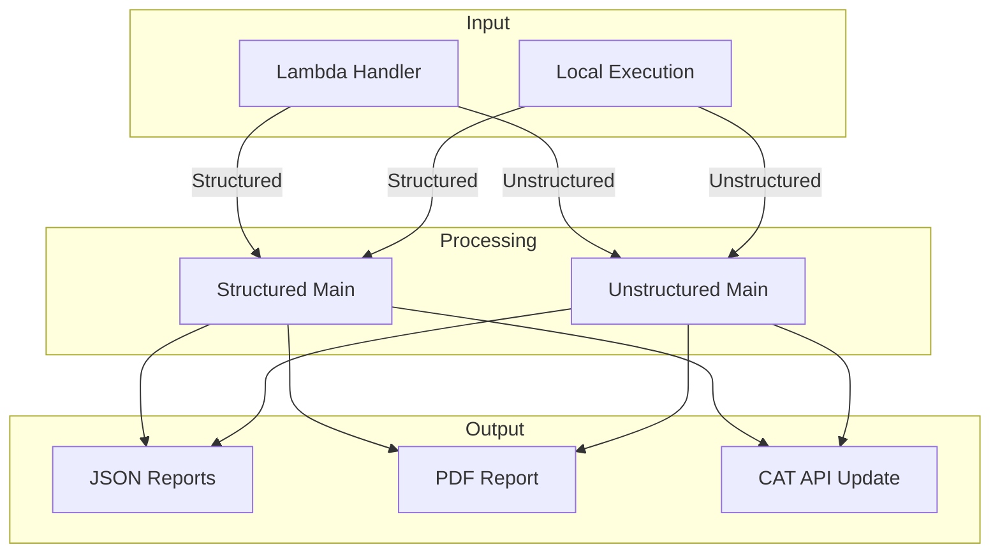
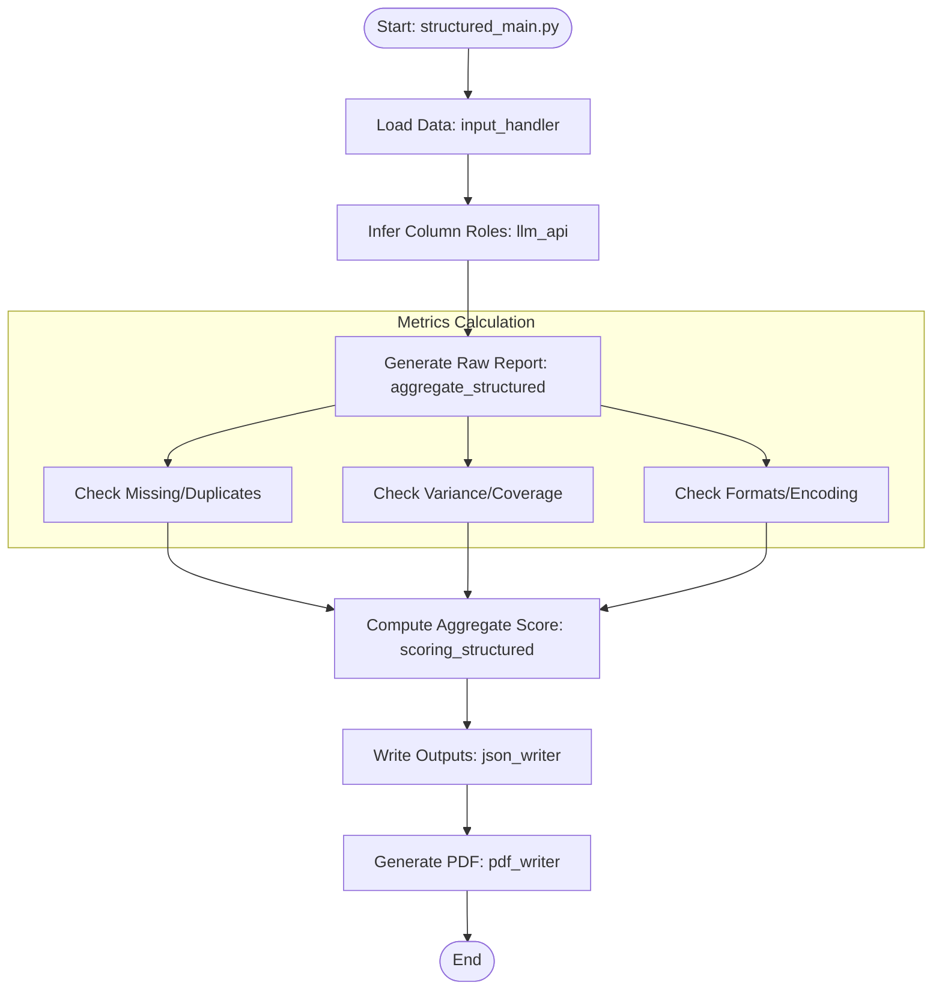
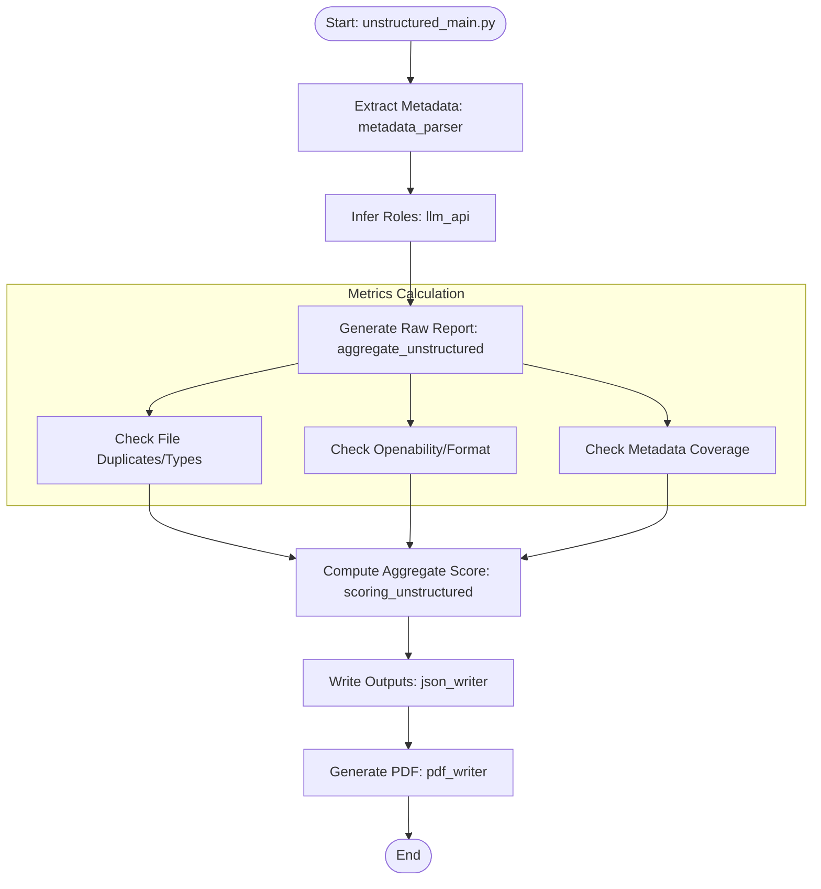

# Data Flow Diagrams

## 1. High-Level Overview
This diagram shows the general flow from entry points to final outputs.

## 2. Structured Data Flow Detail
Detailed flow within the Structured Data processing module.

## 3. Unstructured Data Flow Detail
Detailed flow within the Unstructured Data processing module.

